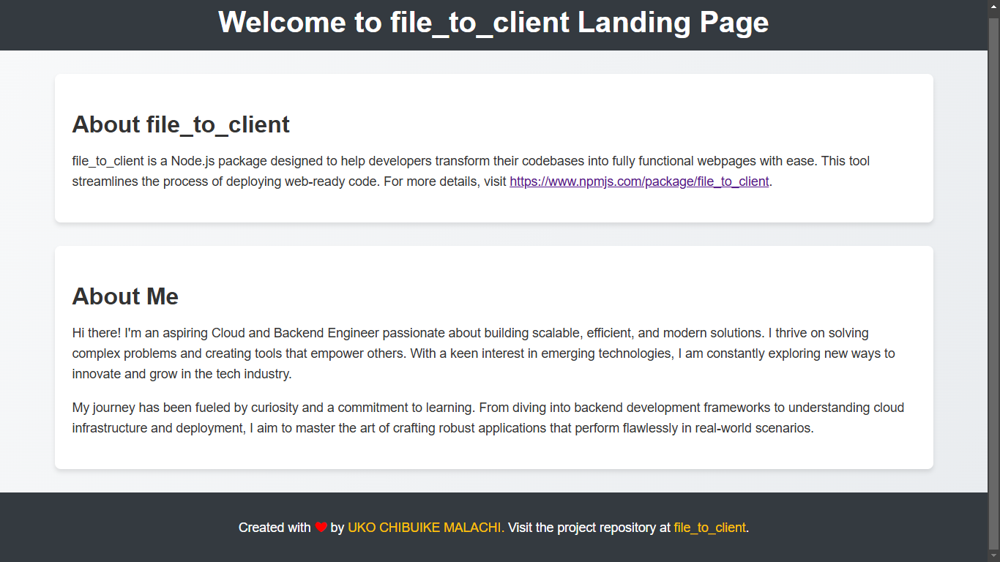

# CLOUD ENGINEERING SECOND SEMESTER PROJECT 
#### TASK
- Provision a Linux Server to serve a simple HTML page.
- Configure the server to allow HTTP traffic (port 80).
- Provide the public IP address (or URL if using DNS) so your page can be accessed from any browser.

#### OBJECTIVE
- Follow a step by step guide to provisioning a linux server to serve a simple HTML page.

###### public IPv4 address: http://13.61.100.20
###### public IPv4 DNS: http://ec2-13-61-100-20.eu-north-1.compute.amazonaws.com



- [Getting Started](#getting-started)
 - [Creating an Instance/Sever & Configuring Server To Allow HTTP Traffic (port 80)](#creating-an-instance-servercompute)
 - [Launching an Instance/Server](#launching-the-instance)
 - [Connecting to Server using SSH  ](#sshing-into-your-server-from-your-local-machine)
 - [Setting up an Apache Server](#setting-up-an-apache2-server)
 - [Testing The Server](#testing-the-server)

## GETTING STARTED

###### INFO: ASSUMPTION IS MADE THAT YOU'RE USING A LAPTOP TO FOLLOW THROUGH THIS GUIDE.

- log into your AWS account as a `IAM user`, which you would have created when
  you initially setup your account.
- after logging in, you would be taken to your `console home`.
- in your `console home`, look for a search bar and type `EC2 or ec2` in the search bar and hit the enter key.
- you would be presented with a search result with `EC2` as the first search result.
- click on the `EC2` search result and you would be taken to another screen that contain
  quite a number of information.
- on the left side of your screen, you would see a section that has a dropdown heading
  the reads `Instances`.
- click on the dropdown option that says `instances` from the list of dropdowns you will see.
- after clicking on the dropdown option, the right side of the screen will be populated with some information to help you create an instance.
- on the right side of the screen toward the top right corner, you will see a button
  with the text, `Launch instances`, click on the button.

### CREATING AN INSTANCE (SERVER/COMPUTE)

- On clicking the button, you will be presented will a new screen that will aid you in creating your instance.
- you will see a section that reads `Name and tags` - you are required to enter a
  name to be identified with your server or instance or compute as some will choose to call it.
- another section reads `Application and OS Images (Amazon Machine Image)` - you
  are required to choose an operating system to be installed on your server or instance. In this case we choose `Ubuntu Server 22.04 LTS (HVM) SSD Volume Type`.Sometimes after
  selecting this option a pop-up might appear, just close the pop-up.
- another section reads `instance Type` - this section help us to choose the number of CPU and RAM size we want our server to have, in this case, we choose the option `(t3.micro, 2 vCPU and 1GiB Memory of RAM)`, which give us 2 virtual CPUs and 1GB of RAM, which is what we get being on free-tier.
- you will see a section that reads `key pair(login)` - this will enable us to create an asymmetric(public and private key) key to use in ssh(secure shell) login.Within this section you will see a text that reads `Create new key pair`,on clicking the text you will be presented with a pop-up screen that has a field to enter a name for the key pair, choose the algorithm to use in creating the key pair(RSA or ED25519) and the file format for the private key(choose the .pem file format).After providing the required details click on `create key pair`, on the click of this button, a public key will be downloaded to your local machine.
- scroll to a section that says `Network settings` - within this section, look towards the top right, you will see a text that reads `Edit`, click on it to make some edits. For the new screen displayed, look for a description field and enter a description for the security group you want to create, scroll to the `Inbound security group rule` section and click on the button with the text `Add security group rule`,you will see a dropdown with the heading `Source type`, select `Anywhere` option from the dropdown options, on selecting the `Anywhere` option, the source field will become uneditable automatically and for the description field, enter the text - allow ssh connection to this server.
- to enable our server to respond to request over http, we need to add another security rule, so let's add another rule by clicking the `Add security group rule` button.
- for the dropdown with the heading `Type` choose `http` from the list of dropdown options. On selecting the `http` the `Protocol` field and `Port range` field will be populated with `TCP` and `80` respectively.
- look for another dropdown heading that reads `Source type` and select the `Custom` option. For the `Source` choose the option `0.0.0.0/0` by clicking inside the field and for the `Description` field, enter the text - allow all ip-address. With this new security rule, our server will be able to respond to http requests.
- scroll to another section that reads `Configure storage` - this helps us to choose the volume capacity of our hard-disk, your can increase the volume size to say 27, this should be more than enough to cater for the software we will install in our server afterwards.

#### LAUNCHING THE INSTANCE

- Look towards the lower right side of the screen for a button that reads `Launch instance` and click on it. Wait while your instance is being created.
- On successful creation of your instance you would see a green banner with a success message and your newly created instance id.
- Look at the top of your screen for a navigation that reads `instances`, click on it and you will be taken to your newly created instance.
- look for a refresh icon (this text provide information on the last time the instance was refreshed) on the newly launched screen and click on the icon to refresh your instance, so your newly created instance shows up.
- click on the checkbox icon close to your newly created instance. If your newly created instance does not show the name you entered in the `Name and tags section`, kindly click on the field close to the checkbox and enter a descriptive name for your instance/server.
- on clicking the checkbox more details about your instance will be displayed below. Look for a text that reads `Public IPV4 address` and copy the corresponding public ip address.
- open your preferred browser and paste the copied public ip address and hit enter. Notice that the request keeps spinning and you get nothing back.
- to fix this we will have to install an apache server in our own server/instance to serve our web content.

##### SSHING INTO YOUR SERVER FROM YOUR LOCAL MACHINE

- on your local machine, open a terminal and navigate to your home(~) directory.
- in your home directory create directory called `CLOUD_ENGINEERING` and cd into `CLOUD_ENGINEERING`.
- in the `CLOUD_ENGINEERING` directory, create a directory called pub_key, in this directory paste the recently downloaded public key that was created in the `key pair(login)` section.
- in your terminal, enter the command ssh -i pub_key/cloud-engineering-key-pair.pem ubuntu@<public-ip-address> and press enter.
- you will see a prompt that reads, `are you sure you want to continue connecting` or something along those lines, type yes and hit enter.
- VIOLA!, you have successfully ssh into your newly created server/instance.

#### SETTING UP AN APACHE2 SERVER

- still in your terminal run the command `sudo apt update` - this will update the OS if need be.
- afterwards run the command `sudo apt upgrade` - this will upgrade the packages already present in your server if any latest update is available. During installation type yes if a prompt shows up to continue with the installation.
- to install an apache2 server. Run the command `sudo apt install apache2`.
- to check if your apache2 server is currently running, run the command `systemctl status apache2`.

#### TESTING THE SERVER

- to check if the apache server can handle requests over http. Head over to the tab you initially pasted your public ip address and hit the refresh icon again.
- now you see that you are greeted with a welcome ubuntu page.
- the page you are greeted with is an `index.html` file located at `/var/www/html` directory on your server. This is the directory the `apache server` looks into to load a webpage(index.html).
- the `index.html` page in the `/var/www/html` directory should be replaced with your own version of index.html to display your own web specific content.

`SPOILER`: The server does not have an interactive UI like vscode, so how do we go about adding our own version of index.html file.

#### scp (secure copy) to the rescue

- with this utility program we can move files from our local machine to our remote server and vice-versa.
- but before that we need to change the permission for the /var/www/html/index.html file to 700.
- in your server run `chmod 600 /var/www/html/index.html` to enable read and write permission for the user.
- create a new `index.html` file in your CLOUD_ENGINEERING directory, by running this command in your terminal `touch index.html`

#### The newly created index.html file should contain the following information:

1. Your name.
2. project title: “Welcome to [Your Name] Landing Page.”
3. A brief description of your project.
4. Your full bio with every interesting information about you

#### Use the below command to copy your index.html file from your local machine to your remote server

```sh
scp -i pub_key/cloud_engineering_key_pair.pem "$(pwd)/index.html" ubuntu@<public-ip-address>:/var/www/html
```

`Refresh your tab and see it populated with your own web specific content.`

###### We now have a web server runnning our webpage.

###### Last words: you can do more than you can imagine.

##### Thanks to `Oladapo Abimbola`, our cloud ☁ instructor, for his prowess in making difficult concepts look seemingly simple. He motivates me in ways he knows not.
